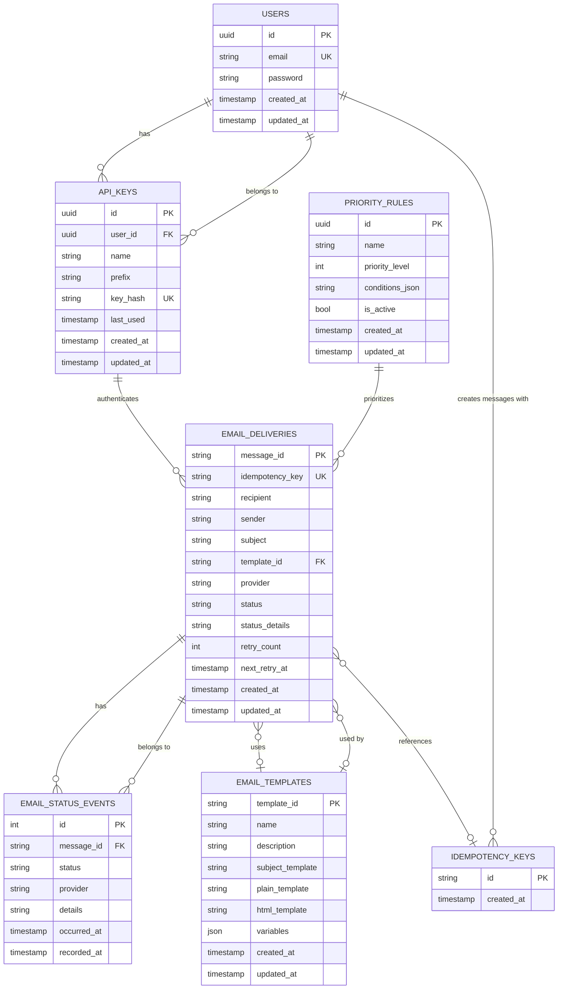

# Notli Microservices Database ER Diagram

This entity-relationship diagram represents the database structure across Notli's microservices architecture. It shows the relationships between different entities and tables within the system.

## Entity Descriptions

### Authentication Service (MS1)
- **USERS**: Stores user accounts with email and password (hashed)
- **API_KEYS**: Authentication tokens for accessing the notification APIs

### Message Queue Service (MS2)
- **IDEMPOTENCY_KEYS**: Ensures message deduplication to prevent duplicate processing

### Priority Service (MS3)
- **PRIORITY_RULES**: Defines rules for message prioritization based on conditions

### Delivery Service (MS4)
- **EMAIL_DELIVERIES**: Main table tracking all email deliveries and their status
- **EMAIL_STATUS_EVENTS**: History of status changes for each delivery (for auditing)
- **EMAIL_TEMPLATES**: Reusable email templates with variable substitution

## Key Relationships

1. Each User can have multiple API Keys
2. Each Email Delivery can have multiple Status Events
3. Email Deliveries can use Email Templates
4. Each Email Delivery references an Idempotency Key
5. API Keys are used to authenticate message submissions
6. Priority Rules determine message handling priority

This diagram provides a comprehensive view of how data flows through the Notli notification system across its microservices architecture.

